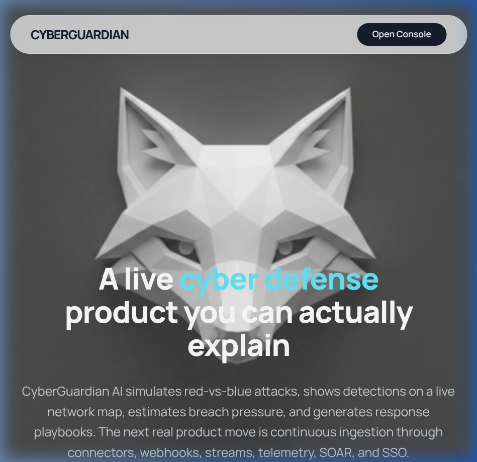
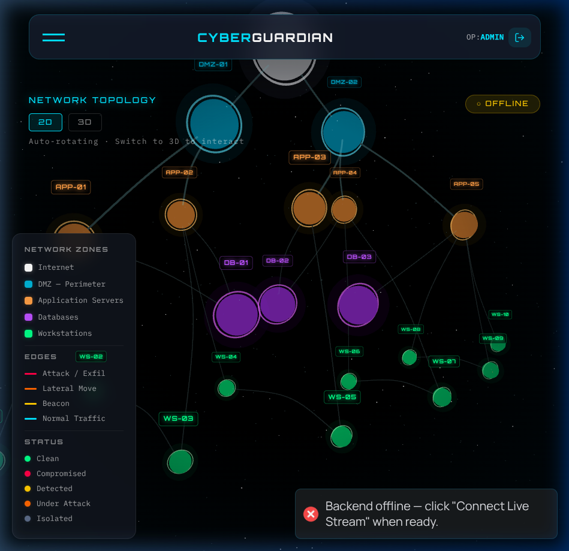
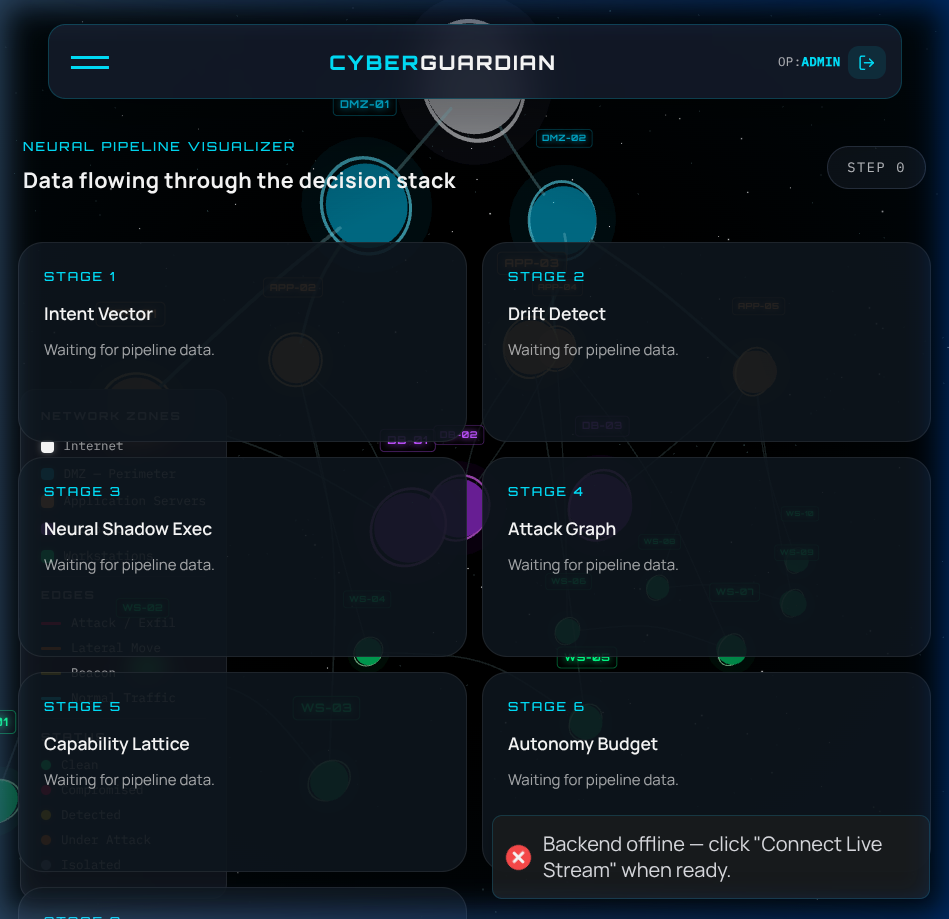
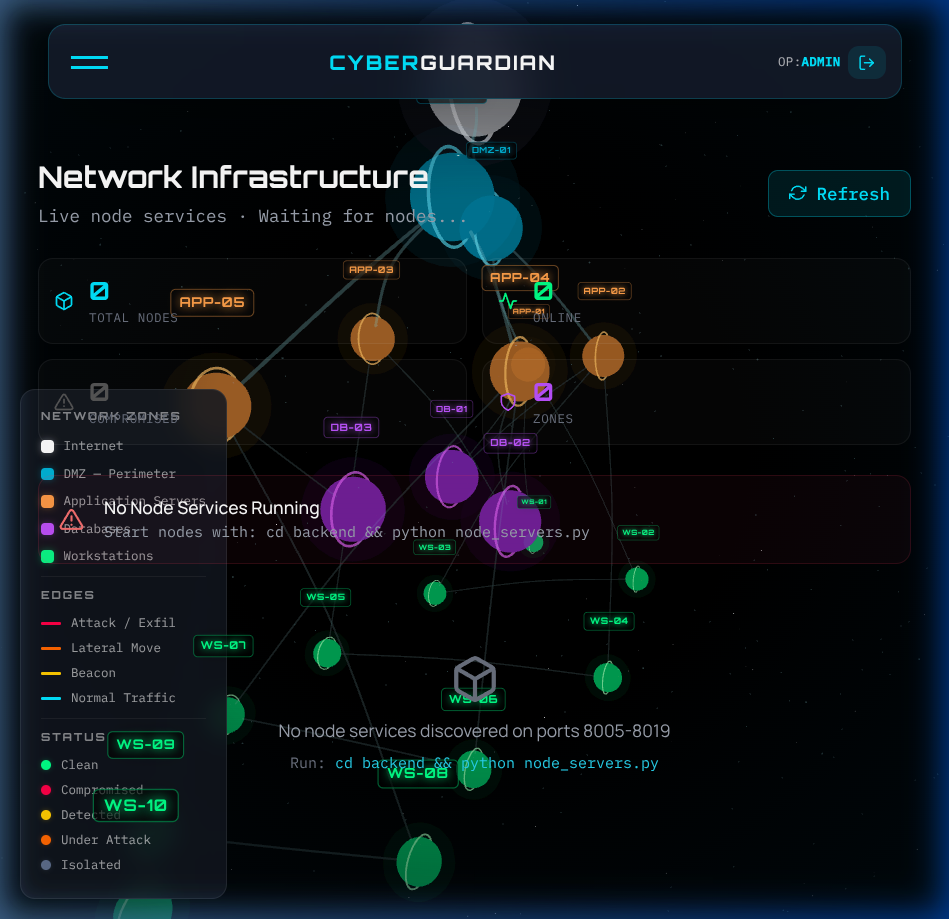
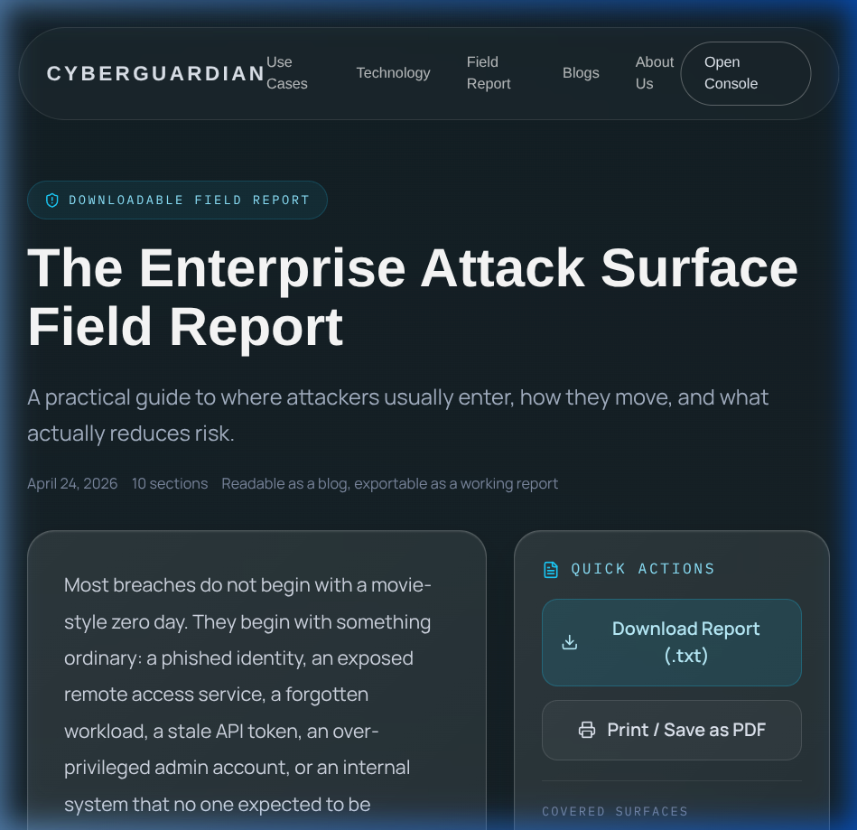

# CyberGuardian by Inari (Athernex Hackathon)



CyberGuardian is a live, interpretable AI-driven cyber defense platform built for the **Athernex Hackathon** by team **Inari**. It visualizes sophisticated network attacks, evaluates threat actors' intent, estimates breach pressure across security zones, and generates autonomous response recommendations—all rendered in a high-fidelity, real-time command console.



## Core Features

- **Live Attack Simulation**: Simulates red-vs-blue engagements with realistic threat models (Ransomware, APTs, Data Exfiltration).
- **Interactive 3D Network Topology**: Dynamic visualization of network zones (DMZ, APP, DB, Workstations), nodes, and traffic flows.
- **Explainable AI Pipeline**: A multi-stage threat intelligence pipeline that makes AI decisions transparent—from Intent Vector analysis to Autonomy Budgeting.
  
- **Node & Docker Management**: Deep integration with underlying infrastructure. View live logs, metrics, modify labels, and restart/stop nodes dynamically.
- **Narrative Reporting**: Generates comprehensive, exportable (`.txt`) security incident reports using LLMs (NVIDIA NeMo/Llama 3).
- **URL Security Scanner**: Built-in malicious URL and domain reputation analysis.

## Architecture & Tech Stack

CyberGuardian employs a modern decoupled architecture:

### Frontend (Client-Side)
Building a highly performant, visually stunning SOC terminal.
- **React 18** and **TypeScript** (via Vite)
- **Three.js / React Three Fiber** for real-time 3D network visualizations
- **Tailwind CSS** (minimal usage, mostly custom vanilla CSS for the retro-futuristic aesthetic)
- **Lucide React** for iconography

### Backend (Server-Side)
Managing simulation states, node orchestration, and LLM integrations.
- **Python 3.10+**
- **FastAPI / Uvicorn** for high-performance async API endpoints
- **Docker SDK** for local container lifecycle management
- **NVIDIA API / OpenAI / Anthropic** LLM integrations for report generation

## Setup & Execution (Linux / Arch)

To run the CyberGuardian environment locally:

### 1. Prerequisites
- Python 3.10+
- Node.js 18+ and `npm`
- Docker (optional, but required for the Docker integration page)
- An LLM API Key (e.g., NVIDIA, set in `backend/.env` as `NVIDIA_API_KEY`)

### 2. Start the Backend (API & Node Simulation)

```bash
cd backend
python3 -m venv .venv
# For bash/zsh: source .venv/bin/activate
# For fish: source .venv/bin/activate.fish

pip install -r requirements.txt

# Start the Node Servers simulation first
python node_servers.py &

# Start the main FastAPI backend
python _start_server.py &
```
*The backend API will run on `http://127.0.0.1:8001`.*

### 3. Start the Frontend (UI)

Open a new terminal window:
```bash
# From the project root
npm install
npm run dev
```
*The frontend development server will start on `http://localhost:5173`.*

### 4. Access the Platform
Navigate to `http://localhost:5173` in your browser. Click **Open Console** to enter the live simulation. If prompted, click **Connect Live Stream** to sync the visualizer with the backend telemetry.

## System Interfaces

### Network Infrastructure & Docker Management
CyberGuardian provides direct command and control over the network infrastructure. If physical Docker containers are running (tagged with `cyberguardian.zone`), they will appear here. Otherwise, the simulated Python nodes can be controlled.


### Automated Field Reports
The system distills technical telemetry into executive-ready incident reports.


---
*Developed by Team Inari tailored specifically for the Athernex hackathon environment.*
